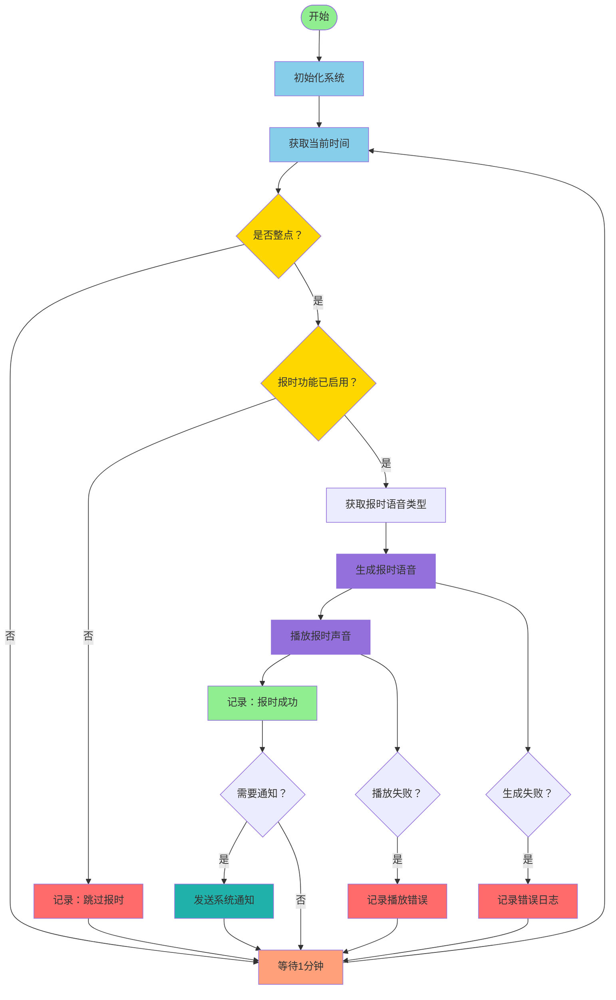

# 整点自动报时系统流程图

## 流程说明

### 主要流程节点

1. **开始** - 程序启动入口
2. **初始化系统** - 加载配置文件、初始化音频模块、设置定时器等
3. **获取当前时间** - 实时获取系统时间
4. **是否整点判断** - 检查当前分钟和秒数是否为 0
5. **报时功能状态检查** - 确认用户是否启用了报时功能
6. **获取语音类型** - 根据配置选择男声/女声/方言等
7. **生成报时语音** - 合成"现在是北京时间 XX 点整"的语音
8. **播放报时声音** - 通过系统音频输出播放
9. **系统通知** - 可选的桌面通知提醒

### 循环机制

- 非整点时：每分钟检查一次
- 整点时：执行报时流程后继续监控
- 持续运行直到用户手动停止

### 异常处理

- 语音生成失败：记录日志，不影响下次报时
- 音频播放失败：记录错误，继续运行
- 所有错误都不中断主循环

## 技术实现建议

- **语言**: Python / JavaScript / Java 等
- **定时**: 使用系统定时器或轮询机制
- **语音**: TTS 引擎 (如 pyttsx3, Google TTS, Azure TTS)
- **音频**: 系统音频 API 或播放器
- **配置**: JSON/YAML 配置文件存储用户偏好
- **日志**: 文件日志记录运行状态
